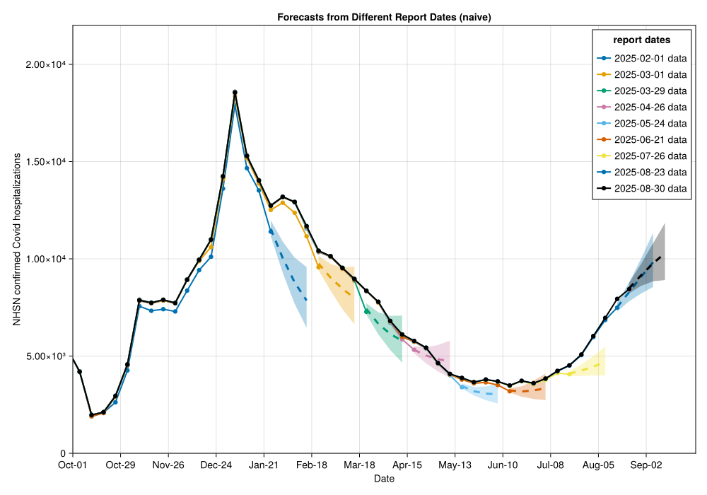
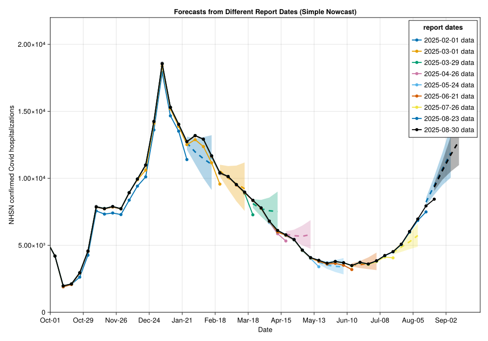
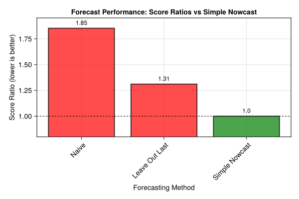

# NowcastAutoGP.jl

[![][docs-stable-img]][docs-stable-url]

*Centers for Disease Control and Prevention • Center for Forecasting and Outbreak Analytics*

**Automated Gaussian Process model discovery for time series data with significant on-going revisions**

**General disclaimer** This repository was created for use by CDC programs to collaborate on public health related projects in support of the [CDC mission](https://www.cdc.gov/about/cdc/#cdc_about_cio_mission-our-mission).  GitHub is not hosted by the CDC, but is a third party website used by CDC and its partners to share information and collaborate on software. CDC use of GitHub does not imply an endorsement of any one particular service, product, or enterprise.

## About

**NowcastAutoGP.jl** is a Julia package for combining **nowcasting** of epidemiological time series data with **forecasting** using an ensemble of Gaussian process (GP) models. The package was developed for the [CDC Center for Forecasting and Outbreak Analytics (CFA)](https://www.cdc.gov/forecasting/index.html) to support real-time situational awareness and epidemiological forecasting.

The basic idea is to use the incremental fitting capabilities of [`AutoGP.jl`](https://github.com/probsys/AutoGP.jl) to batch forecasts over probabilistic nowcasts of recent data points. This accounts for uncertainty in recent data points that are still being revised, while leveraging the flexibility and scalability of Gaussian processes for forecasting.

### Key Features

- **Nowcasting integration**: Handles data revision uncertainty in recent time periods
- **Flexible approach**: Agnostic to the nowcasting method used
- **Ensemble forecasting**: Uses Gaussian process model discovery for robust predictions
- **Real-time capable**: Designed for operational epidemiological surveillance

## Installation

```julia
using Pkg
Pkg.add(url="https://github.com/CDCgov/NowcastAutoGP.jl")
```

## Example Results

The package demonstrates significant improvements over naive forecasting approaches when dealing with data subject to reporting delays:


*Naive forecasting consistently underestimates due to reporting delays*


*Forecasts incorporating simple nowcasting show improved accuracy*


*Score ratios demonstrate clear performance improvements with nowcasting*

## Documentation

📖 **[Latest Documentation](https://cdcgov.github.io/NowcastAutoGP.jl/)**

- **[Getting Started Tutorial](https://cdcgov.github.io/NowcastAutoGP.jl/vignettes/tutorial.html)**: Complete example using NHSN COVID-19 hospitalization data
- **[API Reference](https://cdcgov.github.io/NowcastAutoGP.jl/api.html)**: Detailed function documentation

## Related documents

* [Open Practices](open_practices.md)
* [Rules of Behavior](rules_of_behavior.md)
* [Thanks and Acknowledgements](thanks.md)
* [Disclaimer](DISCLAIMER.md)
* [Contribution Notice](CONTRIBUTING.md)
* [Code of Conduct](code-of-conduct.md)

## Public Domain Standard Notice
This repository constitutes a work of the United States Government and is not
subject to domestic copyright protection under 17 USC § 105. This repository is in
the public domain within the United States, and copyright and related rights in
the work worldwide are waived through the [CC0 1.0 Universal public domain dedication](https://creativecommons.org/publicdomain/zero/1.0/).
All contributions to this repository will be released under the CC0 dedication. By
submitting a pull request you are agreeing to comply with this waiver of
copyright interest.

## License Standard Notice
The repository utilizes code licensed under the terms of the Apache Software
License and therefore is licensed under ASL v2 or later.

This source code in this repository is free: you can redistribute it and/or modify it under
the terms of the Apache Software License version 2, or (at your option) any
later version.

This source code in this repository is distributed in the hope that it will be useful, but WITHOUT ANY
WARRANTY; without even the implied warranty of MERCHANTABILITY or FITNESS FOR A
PARTICULAR PURPOSE. See the Apache Software License for more details.

You should have received a copy of the Apache Software License along with this
program. If not, see http://www.apache.org/licenses/LICENSE-2.0.html

The source code forked from other open source projects will inherit its license.

## Privacy Standard Notice
This repository contains only non-sensitive, publicly available data and
information. All material and community participation is covered by the
[Disclaimer](DISCLAIMER.md)
and [Code of Conduct](code-of-conduct.md).
For more information about CDC's privacy policy, please visit [http://www.cdc.gov/other/privacy.html](https://www.cdc.gov/other/privacy.html).

## Contributing Standard Notice
Anyone is encouraged to contribute to the repository by [forking](https://help.github.com/articles/fork-a-repo)
and submitting a pull request. (If you are new to GitHub, you might start with a
[basic tutorial](https://help.github.com/articles/set-up-git).) By contributing
to this project, you grant a world-wide, royalty-free, perpetual, irrevocable,
non-exclusive, transferable license to all users under the terms of the
[Apache Software License v2](http://www.apache.org/licenses/LICENSE-2.0.html) or
later.

All comments, messages, pull requests, and other submissions received through
CDC including this GitHub page may be subject to applicable federal law, including but not limited to the Federal Records Act, and may be archived. Learn more at [http://www.cdc.gov/other/privacy.html](http://www.cdc.gov/other/privacy.html).

## Records Management Standard Notice
This repository is not a source of government records, but is a copy to increase
collaboration and collaborative potential. All government records will be
published through the [CDC web site](http://www.cdc.gov).

## Additional Standard Notices
Please refer to [CDC's Template Repository](https://github.com/CDCgov/template) for more information about [contributing to this repository](https://github.com/CDCgov/template/blob/main/CONTRIBUTING.md), [public domain notices and disclaimers](https://github.com/CDCgov/template/blob/main/DISCLAIMER.md), and [code of conduct](https://github.com/CDCgov/template/blob/main/code-of-conduct.md).

[docs-stable-img]: https://img.shields.io/badge/docs-stable-blue.svg
[docs-stable-url]: https://cdcgov.github.io/NowcastAutoGP/dev/
