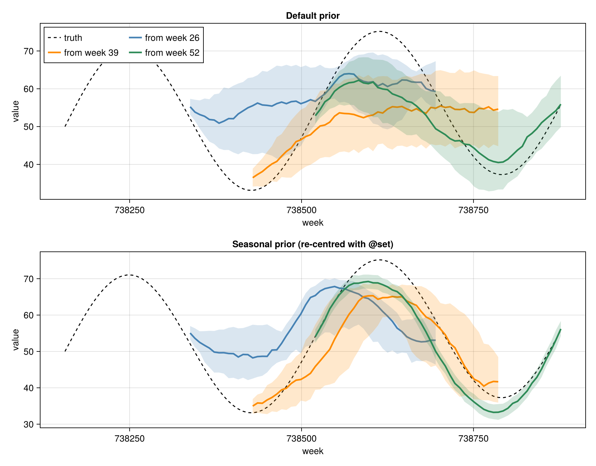
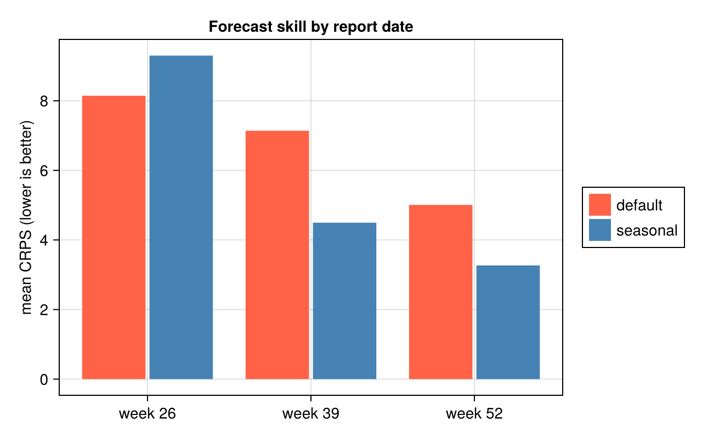

````julia
using Markdown
````

# Setting GP priors with `Accessors.jl`

*Customising the AutoGP prior for epidemiological seasonality*

**CDC Center for Forecasting and Outbreak Analytics (CFA/CDC)**

`make_and_fit_model` accepts a `config` keyword — an `AutoGP.GP.GPConfig` that describes the
Gaussian-process **prior**: the distribution over kernel *structures*
(`node_dist_leaf`/`node_dist_nocp`/`node_dist_cp`) and the priors over kernel *hyperparameters*
(`prior[:gamma]`, `prior[:period]`, `prior[:wildcard]`). The default `GPConfig()` reproduces
AutoGP's out-of-the-box behaviour, but its **period prior** is centred well below an annual cycle, so
a periodic component is unlikely to land on the ~1-year seasonality respiratory diseases actually have.

`GPConfig` is an immutable struct with a nested `prior` `Dict`, which makes "change just this one
field" awkward to write by hand. [`Accessors.jl`](https://github.com/JuliaObjects/Accessors.jl)'s
`@set` macro does exactly that: it returns a *copy* with a single leaf changed and every sibling
preserved. This vignette inspects the default prior, re-centres the period prior with `@set`, and —
following the scoring approach of the [Getting started](getting-started.md) vignette — shows the
re-centred prior gives better forecasts across a few **report dates** spanning one seasonal cycle,
measured by the Continuous Ranked Probability Score (CRPS).

> `Accessors.jl` is a convenience used here in the docs; it is **not** a dependency of
> `NowcastAutoGP` itself. The same edits can be made by constructing a `GPConfig` directly.

## Loading dependencies

````julia
using NowcastAutoGP
using Accessors
using CairoMakie
using Dates, Distributions, Random

Random.seed!(2026)
CairoMakie.activate!(type = "png")
````

## Inspecting the default prior

`GPConfig()` exposes the prior as plain fields. The leaf-kernel distribution is a probability vector
over the primitive kernels, indexed `Constant=1`, `Linear=2`, `SquaredExponential=3`,
`GammaExponential=4`, `Periodic=5`:

````julia
default_config = GPConfig()
default_config.node_dist_leaf
````

````
5-element Vector{Float64}:
 0.0
 0.3333333333333333
 0.0
 0.3333333333333333
 0.3333333333333333
````

The hyperparameter priors live in a nested `Dict`; the period prior is a `LogNormal(μ, σ)` over the
periodic component's period:

````julia
default_config.prior[:period]
````

````
Dict{Symbol, Float64} with 2 entries:
  :mu => -1.5
  :sigma => 1.0
````

AutoGP rescales the input time axis to `[0, 1]` internally, so this period is in *normalised* units —
a fraction of the training window. The default median period is therefore only about a fifth of the
window:

````julia
exp(default_config.prior[:period][:mu]) # ≈ 0.22 of the window
````

````
0.22313016014842982
````

## A seasonal series and a few report dates

We simulate two years of weekly observations with a clear annual cycle, a gentle upward trend and
observation noise. We then imagine sitting at three **report dates** — weeks 26, 39 and 52 (a half,
three-quarters and a full cycle of history) — and at each one forecast a full year ahead. This
mirrors the [Getting started](getting-started.md) workflow of scoring forecasts across report dates
as data accrue.

````julia
start_date = Date(2022, 1, 1)
all_dates = collect(start_date:Week(1):(start_date + Week(103)))   # 104 weekly points ≈ 2 years
n_all = length(all_dates)
tt = 0:(n_all - 1)
truth = 50.0 .+ 20.0 .* sin.(2π .* tt ./ 52) .+ 0.08 .* tt          # annual cycle (52 weeks) + trend
observations = truth .+ 2.0 .* randn(n_all)

report_weeks = [26, 39, 52]
horizon = 52                                                        # forecast one year ahead
report_colours = [:steelblue, :darkorange, :seagreen]

fig_data = let
    fig = Figure(size = (820, 400))
    ax = Axis(fig[1, 1]; xlabel = "week", ylabel = "value", title = "Synthetic weekly series")
    lines!(ax, Dates.value.(all_dates), truth; color = :black, label = "signal")
    scatter!(ax, Dates.value.(all_dates), observations; color = (:black, 0.3), markersize = 5)
    vlines!(
        ax, Dates.value.(all_dates[report_weeks]);
        color = report_colours, linestyle = :dash, linewidth = 2
    )
    axislegend(ax; position = :lt)
    fig
end
````


## Re-centring the period prior with `@set`

A one-year cycle is 52 weeks. In a window of `w` weeks that is a period of `52 / w` in AutoGP's
normalised time, so we re-centre the period prior's median there by setting `μ = log(52 / w)`, and
tighten `σ` to concentrate mass around the annual cycle. For a 39-week window, for example:

````julia
example_window = 39
seasonal_example = @set GPConfig().prior[:period][:mu] = log(52 / example_window)
seasonal_example = @set seasonal_example.prior[:period][:sigma] = 0.3
seasonal_example.prior[:period]
````

````
Dict{Symbol, Float64} with 2 entries:
  :mu => 0.287682
  :sigma => 0.3
````

`@set` returns a fresh `GPConfig`; every sibling prior is carried over unchanged — it only touched
`prior[:period]`:

````julia
seasonal_example.prior[:gamma] == GPConfig().prior[:gamma]
````

````
true
````

## Forecasting from each report date

At each report date we fit two models on the data so far — one with the default prior, one with a
seasonal prior built for that window with `@set` — and forecast a year ahead. Everything except
`config` is identical; the `n_mcmc`/`n_hmc` controls pass straight through to `AutoGP.fit_smc!`. Each
fitted model is a particle ensemble, so each forecast is a full predictive *distribution* — exactly
what CRPS scores below.

````julia
fit_params = (n_particles = 16, smc_data_proportion = 0.1, n_mcmc = 75, n_hmc = 15)
n_draws = 300

Random.seed!(2026)
results = map(report_weeks) do w
    train_data = create_transformed_data(
        all_dates[1:w], observations[1:w]; transformation = identity
    )
    horizon_dates = all_dates[(w + 1):(w + horizon)]
    horizon_truth = truth[(w + 1):(w + horizon)]

    # a seasonal prior for *this* window — an annual cycle is log(52/w) in normalised time
    seasonal_config = @set GPConfig().prior[:period][:mu] = log(52 / w)
    seasonal_config = @set seasonal_config.prior[:period][:sigma] = 0.3

    default_model = make_and_fit_model(train_data; config = GPConfig(), fit_params...)
    seasonal_model = make_and_fit_model(train_data; config = seasonal_config, fit_params...)

    return (;
        report_week = w, horizon_dates, horizon_truth,
        default = forecast(default_model, horizon_dates, n_draws),
        seasonal = forecast(seasonal_model, horizon_dates, n_draws),
    )
end
````

````
┌ Warning: Using more particles than available threads.
└ @ AutoGP ~/.julia/packages/AutoGP/SVRPE/src/api.jl:226
┌ Warning: Using more particles than available threads.
└ @ AutoGP ~/.julia/packages/AutoGP/SVRPE/src/api.jl:226
┌ Warning: Using more particles than available threads.
└ @ AutoGP ~/.julia/packages/AutoGP/SVRPE/src/api.jl:226
┌ Warning: Using more particles than available threads.
└ @ AutoGP ~/.julia/packages/AutoGP/SVRPE/src/api.jl:226
┌ Warning: Using more particles than available threads.
└ @ AutoGP ~/.julia/packages/AutoGP/SVRPE/src/api.jl:226
┌ Warning: Using more particles than available threads.
└ @ AutoGP ~/.julia/packages/AutoGP/SVRPE/src/api.jl:226

````

The default prior (top) tends to extrapolate short cycles or flat trends, while the seasonal prior
(bottom) carries the annual cycle forward. Once three-quarters of a cycle is in view (weeks 39 and 52)
it stays close to the truth (dashed); from only half a cycle (week 26) the annual assumption is a
large extrapolation and overshoots:

````julia
fig_forecasts = let
    fig = Figure(size = (920, 720))
    panels = (
        (key = :default, row = 1, title = "Default prior"),
        (key = :seasonal, row = 2, title = "Seasonal prior (re-centred with @set)"),
    )
    for panel in panels
        ax = Axis(fig[panel.row, 1]; xlabel = "week", ylabel = "value", title = panel.title)
        lines!(
            ax, Dates.value.(all_dates), truth;
            color = :black, linestyle = :dash, label = "truth"
        )
        for (res, colour) in zip(results, report_colours)
            fc = getproperty(res, panel.key)
            fx = Dates.value.(res.horizon_dates)
            lower = [quantile(row, 0.25) for row in eachrow(fc)]
            med = [quantile(row, 0.5) for row in eachrow(fc)]
            upper = [quantile(row, 0.75) for row in eachrow(fc)]
            band!(ax, fx, lower, upper; color = (colour, 0.2))
            lines!(ax, fx, med; color = colour, linewidth = 2.5, label = "from week $(res.report_week)")
        end
        panel.row == 1 && axislegend(ax; position = :lt, nbanks = 2)
    end
    fig
end
````


## Scoring with CRPS

This is a probabilistic model, so we score each predictive *distribution* against the value it should
have predicted using the **Continuous Ranked Probability Score (CRPS)** — the proper scoring rule from
the [Getting started](getting-started.md) vignette (lower is better), reusing the same hand-rolled
estimator:

```math
\text{CRPS}(X, y) = \mathbb{E}[|X - y|] - \frac{1}{2}\mathbb{E}[|X_1 - X_2|]
```

The score is then **averaged over the forecasts** — every week of each report date's one-year-ahead
horizon — which is how a probabilistic forecast is evaluated (no repeated simulations required):

````julia
# Hand-rolled CRPS estimator (reproduced from the Getting started vignette).
function crps(y::Real, X::Vector{<:Real})
    n = length(X)

    # First term: E|X - y|
    term1 = mean(abs.(X .- y))

    # Second term: E|X_1 - X_2| over all ordered pairs
    ordered_pairwise_diffs = [abs(X[i] - X[j]) for i in 1:n for j in (i + 1):n]
    term2 = mean(ordered_pairwise_diffs)

    # CRPS = E|X - y| - 0.5 * E|X_1 - X_2|
    return term1 - 0.5 * term2
end

# mean CRPS over a forecast horizon for a (dates × draws) forecast matrix
mean_crps(truth, fc) = mean(crps(y, collect(X)) for (y, X) in zip(truth, eachrow(fc)))

crps_by_date = map(results) do res
    (;
        report_week = res.report_week,
        default = mean_crps(res.horizon_truth, res.default),
        seasonal = mean_crps(res.horizon_truth, res.seasonal),
    )
end
````

````
3-element Vector{@NamedTuple{report_week::Int64, default::Float64, seasonal::Float64}}:
 (report_week = 26, default = 8.145047072851177, seasonal = 9.299402943763948)
 (report_week = 39, default = 7.139662993075851, seasonal = 4.4957906600468425)
 (report_week = 52, default = 5.006893616792975, seasonal = 3.268268898264733)
````

The seasonal prior is clearly better once enough of the cycle is in view — a much lower CRPS at weeks
39 and 52. At week 26, with only half a cycle observed, the annual assumption overshoots and scores a
little worse: a useful reminder that a prior is an assumption, most valuable when the data can support
it:

````julia
fig_scores = let
    n = length(crps_by_date)
    defaults = [row.default for row in crps_by_date]
    seasonals = [row.seasonal for row in crps_by_date]

    fig = Figure(size = (640, 400))
    ax = Axis(
        fig[1, 1];
        xticks = (1:n, ["week $(row.report_week)" for row in crps_by_date]),
        ylabel = "mean CRPS (lower is better)",
        title = "Forecast skill by report date"
    )
    barplot!(
        ax, repeat(1:n, 2), vcat(defaults, seasonals);
        dodge = vcat(fill(1, n), fill(2, n)),
        color = vcat(fill(:tomato, n), fill(:steelblue, n))
    )
    Legend(
        fig[1, 2],
        [PolyElement(color = :tomato), PolyElement(color = :steelblue)],
        ["default", "seasonal"]
    )
    fig
end
````


Averaged over the three report dates the seasonal prior still comes out ahead overall:

````julia
overall_crps = (;
    default = mean(row.default for row in crps_by_date),
    seasonal = mean(row.seasonal for row in crps_by_date),
)
````

````
(default = 6.7638678942400015, seasonal = 5.687820834025175)
````

## Enabling `SquaredExponential` structure

The leaf-kernel distribution is editable the same way. The default gives `SquaredExponential`
(index 3) **zero** prior mass; `@set` can spread mass evenly over `Linear`, `SquaredExponential`,
`GammaExponential` and `Periodic` (the vector must sum to 1):

````julia
se_config = @set GPConfig().node_dist_leaf = [0.0, 0.25, 0.25, 0.25, 0.25]
se_config.node_dist_leaf
````

````
5-element Vector{Float64}:
 0.0
 0.25
 0.25
 0.25
 0.25
````

`se_config` can be passed to `make_and_fit_model(...; config = se_config)` exactly like the seasonal
one, and edits compose — chain further `@set` calls (or use `@reset`) to adjust the period prior *and*
the kernel distribution together.

## Summary

- `make_and_fit_model(...; config = ...)` forwards any `AutoGP.GP.GPConfig` to the model, so the full
  AutoGP prior is available without re-declaring it in `NowcastAutoGP`.
- `Accessors.@set` is a clean way to change one prior entry while preserving the rest, including deep
  edits into the nested `prior` `Dict`.
- Re-centring `prior[:period]` on the seasonality you expect improves forecasts once enough of the
  cycle is in view — here, a lower mean CRPS over the report dates, with clear gains by weeks 39 and
  52. Like any prior it is an assumption: from only half a cycle it can overshoot, so score it (with
  CRPS, averaged over the forecasts) rather than assuming it always helps.

---

*This page was generated using [Literate.jl](https://github.com/fredrikekre/Literate.jl).*

