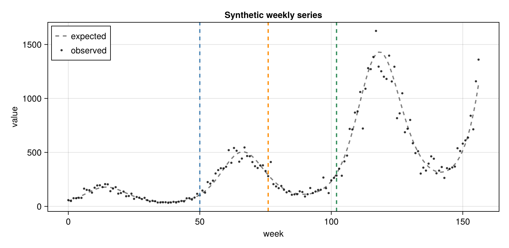
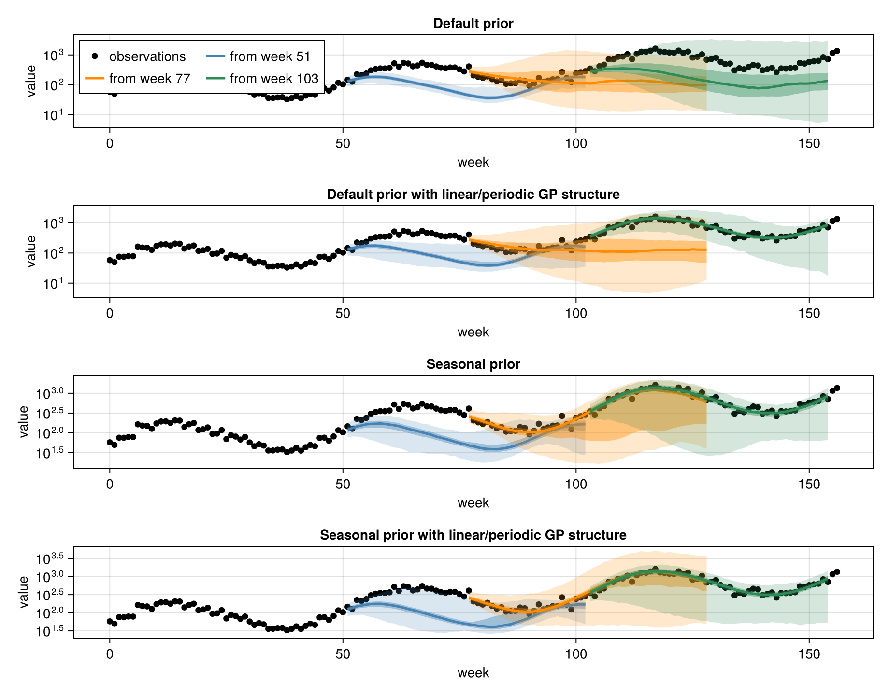
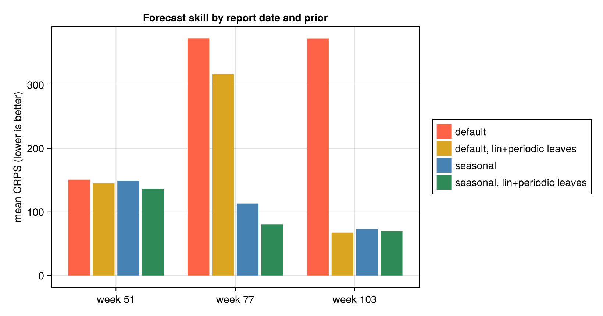

````julia
using Markdown
````

# Setting GP priors with `Accessors.jl`

*Customising the AutoGP prior for epidemiological seasonality*

**CDC Center for Forecasting and Outbreak Analytics (CFA/CDC)**

`make_and_fit_model` accepts a configuration object of type `AutoGP.GP.GPConfig` using the `config`
keyword.
The configuration object describes priors over the Gaussian Process's kernel structure and
hyperparameters.
In this vignette we show how to edit the default `GPConfig()` to give a strong prior
when we expect a certain seasonal cycle, and how that improves forecasts.

In this vignette we are interested in two different priors.
First, the underlying `AutoGP` kernel structure can be represented as a tree with primitive kernels at the leaves, and the internal nodes describing the combinations
`Plus`, `Times` and `ChangePoint`, c.f. [AutoGP.jl documentation](https://probsys.github.io/AutoGP.jl/stable/api.html).
We can use the configuration to set the prior probability for each of the primitive kernels to be a leaf in the structure.
Second, we can set three hyperparameter priors for the `gamma` lengthscale exponent for `GammaExponential` primitive,
`period` period for `Periodic` primitive and `wildcard` for all other hyperparameters.

We will show how to edit the period prior, and likelihood of `Periodic` primitive kernels in the tree kernel structure, to give a
a strong seasonal prior, and how that improves forecasts. We score forecasts following the scoring approach of the [Getting started](getting-started.md) vignette.

`GPConfig` is an immutable struct which makes "change just this one field" awkward to write by hand.
[`Accessors.jl`](https://github.com/JuliaObjects/Accessors.jl)'s `@set` macro does exactly that: it
returns a *copy* with the chosen field(s) changed and all the others preserved.

> `Accessors.jl` is a convenience used here in the docs; it is **not** a dependency of
> `NowcastAutoGP` itself. The same edits can be made by constructing a `GPConfig` directly.

## Loading dependencies

````julia
import NowcastAutoGP.AutoGP as AGP
using NowcastAutoGP
using Accessors
using CairoMakie
using Dates, Distributions, Random

Random.seed!(1234)
CairoMakie.activate!(type = "png")
````

````
Precompiling packages...
   1501.6 ms  ✓ StatsBase
    684.1 ms  ✓ PDMats → StatsBaseExt
   1898.5 ms  ✓ BoxCox
   2650.7 ms  ✓ Distributions
    987.2 ms  ✓ Distributions → DistributionsTestExt
   1376.8 ms  ✓ Distributions → DistributionsChainRulesCoreExt
  10716.0 ms  ✓ AutoGP
   3231.0 ms  ✓ NowcastAutoGP
  8 dependencies successfully precompiled in 19 seconds. 134 already precompiled.
Precompiling packages...
    827.8 ms  ✓ StructArrays
    875.8 ms  ✓ KernelDensity
    688.1 ms  ✓ StructArrays → StructArraysAdaptExt
    814.3 ms  ✓ StructArrays → StructArraysSparseArraysExt
    796.5 ms  ✓ StructArrays → StructArraysStaticArraysExt
    252.2 ms  ✓ StructArrays → StructArraysLinearAlgebraExt
   2742.5 ms  ✓ MathTeXEngine
  11083.1 ms  ✓ TiffImages
  72556.2 ms  ✓ Makie
  25854.3 ms  ✓ CairoMakie
  10 dependencies successfully precompiled in 110 seconds. 259 already precompiled.
Precompiling packages...
    599.0 ms  ✓ Accessors → StructArraysExt
  1 dependency successfully precompiled in 1 seconds. 20 already precompiled.
Precompiling packages...
   9142.4 ms  ✓ BoxCox → BoxCoxMakieExt
  1 dependency successfully precompiled in 10 seconds. 266 already precompiled.

````

## Inspecting the default priors

`GPConfig()` exposes the prior as plain fields. The leaf-kernel distribution is a probability vector
over the primitive kernels, indexed `Constant=1`, `Linear=2`, `SquaredExponential=3`,
`GammaExponential=4`, `Periodic=5`:

````julia
default_config = GPConfig()
default_config.node_dist_leaf
````

````
5-element Vector{Float64}:
 0.0
 0.3333333333333333
 0.0
 0.3333333333333333
 0.3333333333333333
````

So by default, the `SquaredExponential` primitive (index 3) has **zero** prior mass, and is treated as superceded by
the `GammaExponential` (index 4), which recovers it as a special case when the `gamma` lengthscale exponent is exactly 2.
The `Linear` (index 2) and `Periodic` (index 5) primitives have equal prior mass with the `GammaExponential` (index 4),
and the `Constant` (index 1) has zero mass.
Therefore, the default prior is agnostic between `Linear`, `GammaExponential` and `Periodic` primitives.

The hyperparameter priors live in a nested `Dict`; the period prior is a `LogNormal(μ, σ)` over the
periodic component's period:

````julia
default_config.prior[:period]
````

````
Dict{Symbol, Float64} with 2 entries:
  :mu => -1.5
  :sigma => 1.0
````

AutoGP rescales the input time axis to `[0, 1]` internally, so this period is in *normalised* units as a fraction of the training window.
The default median period is therefore only about a fifth of the window:

````julia
exp(default_config.prior[:period][:mu]) # ≈ 0.22 of the window
````

````
0.22313016014842982
````

## Example: A seasonal series and a few report dates

In this example, we imagine having a new data stream for a pathogen, which _a priori_ we know has a strong
annual cycle.
We will make year long forecasts from three different report dates as data accrue: at one, one-and-a-half and two years of history.
We will show how to build a strong seasonal prior into the model in two ways:

1. Re-centring the period prior on an annual cycle for that window.
2. Restricting the leaf-kernel distribution to only allow Linear + Periodic kernels.

To demonstate, we simulate three years of synthetic weekly observations using a simple log-linear model
with annual sinusoidal variation around a linear trend with multiplicative noise.

````julia
start_date = Date(2022, 1, 1)
all_dates = collect(start_date:Week(1):(start_date + Week(52 * 3)))
n_all = length(all_dates)
tt = 0:(n_all - 1)
log_truth = log(50.0) .+ 1.0 .* sin.(2π .* tt ./ 52) .+ 0.02 .* tt
truth = exp.(log_truth)
observations = exp.(log_truth .+ 0.15 .* randn(n_all))

# The report dates are at weeks 51, 77 and 103 (1 year, 1.5 years and 2 years in).
report_weeks = 51 .+ [0, 26, 52]
horizon = 52                                                        # forecast one year ahead
report_colours = [:steelblue, :darkorange, :seagreen]

fig_data = let
    fig = Figure(size = (820, 400))
    ax = Axis(
        fig[1, 1];
        xlabel = "week",
        ylabel = "value",
        title = "Synthetic weekly series",
    )
    tvals = Dates.value.(all_dates .- first(all_dates)) / 7
    lines!(
        ax, tvals, truth;
        color = (:black, 0.5), label = "expected",
        linestyle = :dash, linewidth = 2
    )
    scatter!(
        ax, tvals, observations;
        color = (:black, 0.8), markersize = 5, label = "observed"
    )
    vlines!(
        ax, Dates.value.(all_dates[report_weeks]  .- first(all_dates)) ./ 7;
        color = report_colours, linestyle = :dash, linewidth = 2
    )
    axislegend(ax; position = :lt)
    fig
end
````


### Choosing priors

#### Re-centring the period prior with `@set`

AutoGP works in *normalised* time: it rescales the training window to `[0, 1]`, so a `Periodic`
kernel's period is expressed as a **fraction of the window**, and `prior[:period]` is a
`LogNormal(μ, σ)` over that fraction.
We can re-centre the prior using`@set` to give a new `μ` — here, held tightly with a small `σ`.
For example, for a three year window of data an annual cycle is 1/3 of the window, so `μ = log(1/3)`:

````julia
seasonal_example = @set GPConfig().prior[:period][:mu] = -log(3.0)
seasonal_example = @set seasonal_example.prior[:period][:sigma] = 0.1
seasonal_example.prior[:period]
````

````
Dict{Symbol, Float64} with 2 entries:
  :mu => -1.09861
  :sigma => 0.1
````

`@set` returns a fresh `GPConfig`; every other prior, and other fields, are carried over unchanged.
`@set` only touched `prior[:period]`:

````julia
seasonal_example.prior[:gamma] == GPConfig().prior[:gamma]
````

````
true
````

#### Alterating the leaf-kernel distribution

The leaf-kernel distribution is a simple probability vector over the primitive kernels.
We can use `@set` to change it, for example to specialise on only Linear + Periodic kernels (indices 2 and 5):

````julia
config_lin_period = @set GPConfig().node_dist_leaf = [0.0, 0.5, 0.0, 0.0, 0.5]
````

````
AutoGP.GP.GPConfig
  Constant: Int64 1
  Linear: Int64 2
  SquaredExponential: Int64 3
  GammaExponential: Int64 4
  Periodic: Int64 5
  Plus: Int64 6
  Times: Int64 7
  ChangePoint: Int64 8
  index_to_node: Dict{Integer, Type{<:AutoGP.GP.Node}}
  node_dist_leaf: Array{Float64}((5,)) [0.0, 0.5, 0.0, 0.0, 0.5]
  node_dist_nocp: Array{Float64}((7,)) [0.0, 0.21428571428571427, 0.0, 0.21428571428571427, 0.21428571428571427, 0.17857142857142858, 0.17857142857142858]
  node_dist_cp: Array{Float64}((8,)) [0.0, 0.21428571428571427, 0.0, 0.21428571428571427, 0.21428571428571427, 0.14285714285714285, 0.14285714285714285, 0.07142857142857142]
  max_branch: Int64 2
  max_depth: Int64 -1
  changepoints: Bool true
  noise: Nothing nothing
  prior: Dict{Any, Any}

````

### Forecasting from each report date

At each report date we fit four models on the data so far that only differ in their priors:

- Default prior (the default `GPConfig()`)
- Default hyperpriors, but only `Linear` + `Periodic` primitive leaf-kernels allowed, prior on other kernels set to zero.
- Seasonal hyperprior, fairly tight around an annual cycle, but the default primitive leaf-kernel distribution.
- Seasonal hyperprior, _and_ only `Linear` + `Periodic` primitive leaf-kernels allowed, prior on other kernels set to zero.

Everything except `config` is identical; the `n_mcmc`/`n_hmc` controls pass straight through to `AutoGP.fit_smc!`.
We also set `adaptive_rejuvenation = true` to use the classic SMC resample-then-move adaptive rejuvenation scheme;
that is we make MCMC moves only when the effective sample size (ESS) of the particle ensemble drops below the default threshold of 50% of the particle number.
Each fitted model is a particle ensemble over GP tree-kernels, so each forecast is a full predictive *distribution*.

````julia
n_particles = 32
fit_params = (
    smc_data_proportion = 0.005,
    n_mcmc = 200,
    n_hmc = 50,
    adaptive_rejuvenation = true,
)
n_draws = 2000

results = map(report_weeks) do w
    horizon_dates = all_dates[(w + 1):(w + horizon)]
    horizon_truth = observations[(w + 1):(w + horizon)]

    transformation, inv_transformation = get_transformations("positive", observations[1:w])
    train_data = create_transformed_data(
        all_dates[1:w], observations[1:w]; transformation
    )

    # a seasonal prior for *this* window: an annual cycle is 365 days and the window spans
    # `window_length` days, so in normalised units the period is 365/window_length → μ = log(365/window_length)
    window_length = Dates.value(all_dates[w] - all_dates[1])
    seasonal_config = @set GPConfig().prior[:period][:mu] = log(365 / window_length)
    seasonal_config = @set seasonal_config.prior[:period][:sigma] = 0.3
    seasonal_config_lin_period_prior = @set seasonal_config.node_dist_leaf = [0.0, 0.5, 0.0, 0.0, 0.5]
    default_config_lin_period_prior = @set GPConfig().node_dist_leaf = [0.0, 0.5, 0.0, 0.0, 0.5]

    default_model = make_and_fit_model(
        train_data;
        n_particles, config = GPConfig(), fit_params...
    )
    seasonal_model = make_and_fit_model(
        train_data;
        n_particles, config = seasonal_config, fit_params...
    )
    seasonal_config_lin_period_model = make_and_fit_model(
        train_data;
        n_particles, config = seasonal_config_lin_period_prior, fit_params...
    )
    default_config_lin_period_model = make_and_fit_model(
        train_data;
        n_particles, config = default_config_lin_period_prior, fit_params...
    )

    return (;
        report_week = w,
        horizon_dates,
        horizon_truth,
        default = forecast(
            default_model, horizon_dates, n_draws;
            inv_transformation
        ),
        seasonal = forecast(
            seasonal_model, horizon_dates, n_draws;
            inv_transformation
        ),
        seasonal_config_lin_period = forecast(
            seasonal_config_lin_period_model, horizon_dates, n_draws;
            inv_transformation
        ),
        default_config_lin_period = forecast(
            default_config_lin_period_model, horizon_dates, n_draws;
            inv_transformation
        ),
        default_model = default_model,
        seasonal_model = seasonal_model,
        seasonal_config_lin_period_model = seasonal_config_lin_period_model,
        default_config_lin_period_model = default_config_lin_period_model,
    )
end
````

````
[ Info: Using positive transformation with offset = 0.0
┌ Warning: Using more particles than available threads.
└ @ AutoGP ~/.julia/packages/AutoGP/SVRPE/src/api.jl:226
┌ Warning: Using more particles than available threads.
└ @ AutoGP ~/.julia/packages/AutoGP/SVRPE/src/api.jl:226
┌ Warning: Using more particles than available threads.
└ @ AutoGP ~/.julia/packages/AutoGP/SVRPE/src/api.jl:226
┌ Warning: Using more particles than available threads.
└ @ AutoGP ~/.julia/packages/AutoGP/SVRPE/src/api.jl:226
[ Info: Using positive transformation with offset = 0.0
┌ Warning: Using more particles than available threads.
└ @ AutoGP ~/.julia/packages/AutoGP/SVRPE/src/api.jl:226
┌ Warning: Using more particles than available threads.
└ @ AutoGP ~/.julia/packages/AutoGP/SVRPE/src/api.jl:226
┌ Warning: Using more particles than available threads.
└ @ AutoGP ~/.julia/packages/AutoGP/SVRPE/src/api.jl:226
┌ Warning: Using more particles than available threads.
└ @ AutoGP ~/.julia/packages/AutoGP/SVRPE/src/api.jl:226
[ Info: Using positive transformation with offset = 0.0
┌ Warning: Using more particles than available threads.
└ @ AutoGP ~/.julia/packages/AutoGP/SVRPE/src/api.jl:226
┌ Warning: Using more particles than available threads.
└ @ AutoGP ~/.julia/packages/AutoGP/SVRPE/src/api.jl:226
┌ Warning: Using more particles than available threads.
└ @ AutoGP ~/.julia/packages/AutoGP/SVRPE/src/api.jl:226
┌ Warning: Using more particles than available threads.
└ @ AutoGP ~/.julia/packages/AutoGP/SVRPE/src/api.jl:226

````

We forecast a year ahead from each report date under all four priors (one row each).

````julia
fig_forecasts = let
    fig = Figure(size = (920, 720))
    panels = (
        (key = :default, row = 1, title = "Default prior"),
        (key = :default_config_lin_period, row = 2, title = "Default prior with linear/periodic GP structure"),
        (key = :seasonal, row = 3, title = "Seasonal prior"),
        (key = :seasonal_config_lin_period, row = 4, title = "Seasonal prior with linear/periodic GP structure"),
    )
    tvals = Dates.value.(all_dates .- first(all_dates)) / 7
    for panel in panels
        ax = Axis(
            fig[panel.row, 1];
            xlabel = "week", ylabel = "value", title = panel.title,
            yscale = log10,
        )
        scatter!(
            ax, tvals, observations;
            color = :black, label = "observations"
        )
        for (res, colour) in zip(results, report_colours)
            fc = getproperty(res, panel.key)
            fx = Dates.value.(res.horizon_dates .- first(all_dates)) / 7 # convert to weeks for x-axis
            lower_025 = [quantile(row, 0.025) for row in eachrow(fc)]
            lower_25 = [quantile(row, 0.25) for row in eachrow(fc)]
            med = [quantile(row, 0.5) for row in eachrow(fc)]
            upper_75 = [quantile(row, 0.75) for row in eachrow(fc)]
            upper_975 = [quantile(row, 0.975) for row in eachrow(fc)]
            band!(ax, fx, lower_025, upper_975; color = (colour, 0.2))
            band!(ax, fx, lower_25, upper_75; color = (colour, 0.4))
            lines!(ax, fx, med; color = colour, linewidth = 2.5, label = "from week $(res.report_week)")
        end
        panel.row == 1 && axislegend(ax; position = :lt, nbanks = 2)
    end
    fig
end
````


We see that incorporating our prior knowledge of seasonality substantially improves forecasts.
However, this improvement is not uniform; at the first report date, when only one year of data is available, there is insufficient information to learn the secular trend underneath the seasonal variation.
By one and a half years, the change in compared to the previous season is clearer, and the strong seasonal prior allows the model to extrapolate that pattern forward.
This is especially pronounced when we restrict the leaf-kernel distribution to only allow `Linear` + `Periodic` primitives.
Later on, the model has locked onto a combination of kernels that captures the trend and seasonality, so the restriction to `Linear` + `Periodic` leaves makes less difference.

### Scoring with CRPS

We score each forecast against out-of-sample observations using the **Continuous Ranked Probability Score (CRPS)** a proper scoring rule from
the [Getting started](getting-started.md) vignette (lower is better), reusing the same hand-rolled
estimator:

```math
\text{CRPS}(X, y) = \mathbb{E}[|X - y|] - \frac{1}{2}\mathbb{E}[|X_1 - X_2|]
```

````julia
# Hand-rolled CRPS estimator (reproduced from the Getting started vignette).
function crps(y::Real, X::Vector{<:Real})
    n = length(X)

    # First term: E|X - y|
    term1 = mean(abs.(X .- y))

    # Second term: E|X_1 - X_2| over all ordered pairs
    ordered_pairwise_diffs = [abs(X[i] - X[j]) for i in 1:n for j in (i + 1):n]
    term2 = mean(ordered_pairwise_diffs)

    # CRPS = E|X - y| - 0.5 * E|X_1 - X_2|
    return term1 - 0.5 * term2
end

# mean CRPS over a forecast horizon for a (dates × draws) forecast matrix
mean_crps(truth, fc) = mean(crps(y, collect(X)) for (y, X) in zip(truth, eachrow(fc)))

crps_by_date = map(results) do res
    (;
        report_week = res.report_week,
        default = mean_crps(res.horizon_truth, res.default),
        default_lin_period = mean_crps(res.horizon_truth, res.default_config_lin_period),
        seasonal = mean_crps(res.horizon_truth, res.seasonal),
        seasonal_lin_period = mean_crps(res.horizon_truth, res.seasonal_config_lin_period),
    )
end
````

````
3-element Vector{@NamedTuple{report_week::Int64, default::Float64, default_lin_period::Float64, seasonal::Float64, seasonal_lin_period::Float64}}:
 (report_week = 51, default = 150.96006350854293, default_lin_period = 145.27157670070207, seasonal = 148.997823973993, seasonal_lin_period = 136.28855586242133)
 (report_week = 77, default = 373.30063983623944, default_lin_period = 316.81415453481105, seasonal = 113.39882438274986, seasonal_lin_period = 80.6348313345601)
 (report_week = 103, default = 373.15777527071725, default_lin_period = 67.68526919040802, seasonal = 73.13602965490337, seasonal_lin_period = 69.887260753688)
````

Scoring confirms the visual impression.
The strong seasonal prior gives a markedly lower CRPS, after there is available contrast between the seasons to allow the secular trend to be learned.

````julia
fig_scores = let
    # one dodged bar per approach, grouped by report date
    approaches = [
        (key = :default, label = "default", colour = :tomato),
        (key = :default_lin_period, label = "default, lin+periodic leaves", colour = :goldenrod),
        (key = :seasonal, label = "seasonal", colour = :steelblue),
        (key = :seasonal_lin_period, label = "seasonal, lin+periodic leaves", colour = :seagreen),
    ]
    n = length(crps_by_date)

    xs = Int[]
    heights = Float64[]
    dodge = Int[]
    colours = Symbol[]
    for (j, approach) in enumerate(approaches), (i, row) in enumerate(crps_by_date)
        push!(xs, i)
        push!(heights, getproperty(row, approach.key))
        push!(dodge, j)
        push!(colours, approach.colour)
    end

    fig = Figure(size = (820, 430))
    ax = Axis(
        fig[1, 1];
        xticks = (1:n, ["week $(row.report_week)" for row in crps_by_date]),
        ylabel = "mean CRPS (lower is better)",
        title = "Forecast skill by report date and prior"
    )
    barplot!(ax, xs, heights; dodge = dodge, color = colours)
    Legend(
        fig[1, 2],
        [PolyElement(color = a.colour) for a in approaches],
        [a.label for a in approaches]
    )
    fig
end
````


Averaged over the report dates the strong seasonal prior is the clear winner; the leaf-kernel
restriction barely changes the score, with or without it:

````julia
overall_crps = (;
    default = mean(row.default for row in crps_by_date),
    default_lin_period = mean(row.default_lin_period for row in crps_by_date),
    seasonal = mean(row.seasonal for row in crps_by_date),
    seasonal_lin_period = mean(row.seasonal_lin_period for row in crps_by_date),
)
````

````
(default = 299.13949287183317, default_lin_period = 176.59033347530703, seasonal = 111.84422600388207, seasonal_lin_period = 95.60354931688981)
````

## Summary

- `make_and_fit_model(...; config = ...)` forwards any `AutoGP.GP.GPConfig` to the model, so the full
  AutoGP prior is available without re-declaring it in `NowcastAutoGP`.
- `Accessors.@set` is a clean way to change one prior entry while preserving the rest, including deep
  edits into the nested `prior` `Dict`.
- Re-centring the period *hyperparameter* prior (`prior[:period]`) on the seasonality you expect can
  substantially improve forecasts — here the strong seasonal prior gives the lowest mean CRPS across
  the report dates.
- Editing the *structural* prior (`node_dist_leaf`) to allow only Linear + Periodic leaves also improves forecasts.
- However, note that strong priors can be a double-edged sword: they can help when data are scarce, but if they are too tight or the wrong shape they can be a problem.

---

*This page was generated using [Literate.jl](https://github.com/fredrikekre/Literate.jl).*

