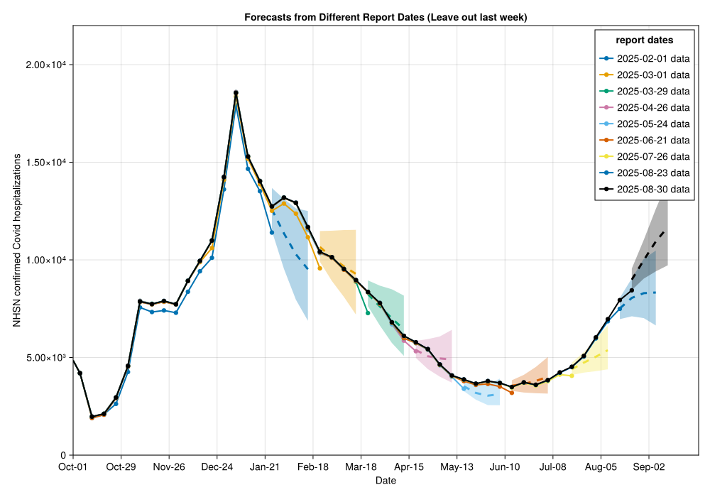

# Getting Started with `NowcastAutoGP`
CDC Center for Forecasting and Outbreak Analytics (CDC/CFA)

# Introduction

This tutorial demonstrates how to use `NowcastAutoGP` for
epidemiological forecasting - making forecasts of future disease
activity despite reporting delays making the latest data unreliable.
This is a common challenge in public health surveillance where case
reports arrive with delays. In this tutorial, we will want to forecast
future weekly hospital admissions with confirmed Covid diagnosis despite
uncertainty around the eventual value of recent admissions. The reason
for the uncertainty is that despite *eventually* having a record of
severe cases arriving in a given week (we call this the reference date),
at any given reporting week (we call this the report date) recent
reference dates will not have complete data.

## What is Nowcasting?

Nowcasting is a form of forecasting aimed at the question: *“What will
be the eventual value of my time series, given recent reporting?”*

From our perspective common applications are:

- COVID-19/Influenza/RSV hospital admissions
- COVID-19/Influenza/RSV Emergency department visits
- Real-time monitoring of reproductive numbers $R_t$

## The purpose of `NowcastAutoGP`

The time series Gaussian process structure discovery and ensemble
forecast package [`AutoGP.jl`](https://github.com/probsys/AutoGP.jl) is
highly impressive, but doesn’t include features for ingesting the kind
of data we expect from a signal that needs significant nowcasting to
become reliable.

`NowcastAutoGP` is an extension of `AutoGP` that uses `AutoGP`’s
incremental inference features to include nowcasting results into the
forecasting problem.

When forecasting a time series

```math
X_T[1:T] = (X_{t,T})_{t=1:T}
```

on report date $T$ we split between data on a backwards horizon $D$ where we
consider older data “confirmed”

```math
X_T[1:(T-D)] = (X_{t,T})_{t=1:(T-D)}
```

And that we don’t expect any further revision to; that is we expect that

```math
X_T[1:(T-D)] = X_\infty[1:(T-D)].
```

The rest of the data we consider “unconfirmed” $X_T[(T-D+1):T]$ where we expect potentially significant future revisions and $X_T[(T-D+1):T] \neq X_\infty[(T-D+1):T]$.

Suppose, we have a nowcasting model that generates $K$ samples that
forecast the *eventual* time series over the uncertain data period the
$k$th sample being

```math
X^{(k)}_\infty[(T-D+1):T] = (X^{(k)}_{t,\infty})_{t=(T-D+1):T}
```

for example by sampling from the posterior distribution. Then we can improve
our `AutoGP` forecasting for the *eventual* value on reference date
$f > T$ by replacing our “naive” forecast distribution:

```math
\mathbb{P}(X_{f,\infty} | X_T[1:(T-D)], X_T[(T-D+1):T])
```

with the nowcast estimates for the uncertain data:

```math
\mathbb{P}(X_{f,\infty} \mid X_T[1:(T-D)], X_\infty[(T-D+1):T]) = \frac{1}{K} \sum_k \mathbb{P}(X_{f,\infty} |  X_T[1:(T-D)], X^{(k)}_\infty[(T-D+1):T])
```

This kind of forecasting is particularly convenient for `AutoGP`: we can
use the standard end-to-end inference for the confirmed data and then
batch over the sampled nowcasts using incremental inference.

## Methodology overview

The main functions we offer for inference and forecasting are:

- `NowcastAutoGP.make_and_fit_model`: This wraps `AutoGP` functionality
  to make inference on the **stable** part of the time series data using
  sequential Monte Carlo (SMC) over sequences of data ingestion over
  `n_particle` SMC particles. Each particle represents a Gaussian
  process (GP) model for the time series, and at each data ingestion
  step this particle ensemble can be resampled. Within each SMC particle
  new possible GP kernel structures and hyperparmeter values are
  proposed using a specialised MCMC proposal distribution for structural
  choices (see [`AutoGP`
  overview](https://probsys.github.io/AutoGP.jl/stable/api.html) for
  details) and HMC for continuous parameter samples.

- `NowcastAutoGP.forecast_with_nowcasts`: This batches over proposed
  nowcasts for recent data, incrementally adding nowcast *possible* data
  to make forecasts before removing. The forecast distribution is the
  batch of forecasts over nowcasts of recent data.

# Using `NowcastAutoGP` with NHSN hospitalisation data

## Loading dependencies

``` julia
using NowcastAutoGP
using CairoMakie
using Dates, Distributions, Random
using CSV, TidierData

# Set random seed for reproducibility
Random.seed!(123)

# Set CairoMakie output to png for quarto compat
CairoMakie.activate!(type = "png")
```

## Loading Surveillance Data

We are going to demonstrate using `NowcastAutoGP` for forecasting the
CDC’s National Healthcare Safety Network (NHSN) reported Covid
hospitalisations. We stored a vintaged data set locally.

``` julia
datapath = joinpath(@__DIR__(), "data", "vintaged_us_nhsn_data.csv")
nhsn_vintage_covid_data = CSV.read(datapath, DataFrame)

# Add time_index column for plotting (1 = minimum date, 2 = next date, etc.)
unique_dates = sort(unique(nhsn_vintage_covid_data.reference_date))
d2index(d) = (d - minimum(unique_dates)).value

# Add time_index column using transform!

nhsn_vintage_covid_data = @mutate(nhsn_vintage_covid_data, time_index = d2index(reference_date))
@glimpse(nhsn_vintage_covid_data)
```

    Rows: 4102
    Columns: 8
    .reference_dateDates.Date     2022-10-01, 2022-10-01, 2022-10-01, 2022-10-01, 20
    .report_date   Dates.Date     2025-02-01, 2025-02-08, 2025-02-15, 2025-02-22, 20
    .confirm       Float64        26180.0, 26180.0, 26180.0, 26180.0, 26180.0, 26180
    .max_confirm   Float64        26150.0, 26150.0, 26150.0, 26150.0, 26150.0, 26150
    .lag           Int64          854, 861, 868, 875, 882, 889, 896, 903, 910, 917,
    .multiplier    Float64        0.9988540870893812, 0.9988540870893812, 0.99885408
    .geo_value     InlineStrings.String3us, us, us, us, us, us, us, us, us, us, us,
    .time_index    Int64          0, 0, 0, 0, 0, 0, 0, 0, 0, 0, 0, 0, 0, 0, 0, 0, 0,

We see that the most recent report date, especially, is often revised
upward eventually.

``` julia
unique_report_dates = sort(unique(nhsn_vintage_covid_data.report_date))
# Select every 4th report date, but always include the latest one
selected_dates = unique_report_dates[1:4:end]
if unique_report_dates[end] ∉ selected_dates
    selected_dates = vcat(selected_dates, unique_report_dates[end])
end
n_dates = length(selected_dates)

# Create figure
fig = Figure(size = (800, 600))
ax = Axis(fig[1, 1],
    xlabel = "Reference Date",
    ylabel = "NHSN confirmed Covid hospitalisations",
    title = "Reference Date vs Confirm by Report Date (Oct 2024+, all US)"
)

# Generate colors - latest date will be black
colors = [i == n_dates ? :black : Makie.wong_colors()[mod1(i, 7)] for i in 1:n_dates]

# Plot each selected report date using time_index
for (report_date, color) in zip(selected_dates, colors)
    date_data = @chain nhsn_vintage_covid_data begin
        @filter(report_date == !!report_date)
        @arrange(reference_date)
    end

    scatterlines!(ax, date_data.time_index, date_data.confirm,
        color = color,
        label = string(report_date),
        markersize = 8,
        linewidth = 2
    )
end

# Set up custom x-axis with date strings
# Get date range for the plot and corresponding indices
plot_start_date = Date(2024, 10, 1)
plot_end_date = Date(2025, 10, 1)

# Create tick positions and labels (show every 4 weeks ≈ monthly)
tick_dates = range(plot_start_date, step = Week(4), length = 13)

# plot_start_date:Week(4):plot_end_date
tick_indices = d2index.(tick_dates)
tick_labels = [monthname(d)[1:3] * "-" * string(d)[(end-1):end] for d in tick_dates] # Show month-day

ax.xticks = (tick_indices, tick_labels)

# Add legend
axislegend(ax, "report dates"; position = :rt)
xlims!(ax, d2index(plot_start_date), d2index(plot_end_date))
ylims!(ax, 0, 2.2e4)
resize_to_layout!(fig)
fig
```

### Training data

We know that some recent periods have had bad reporting for NHSN, so we
exclude them from the training data.

``` julia
exclusion_periods = [(Date(2024, 5, 1), Date(2024, 6, 1)),
    (Date(2024, 10, 1), Date(2024, 11, 15))]

training_data = let
    function in_any_period(d)
        in_periods = [d >= period[1] && d <= period[2] for period in exclusion_periods]
        return ~any(in_periods)
    end

    @chain nhsn_vintage_covid_data begin
        @filter(in_any_period(reference_date))
    end
end
@glimpse(training_data)
```

    Rows: 3772
    Columns: 8
    .reference_dateDates.Date     2022-10-01, 2022-10-01, 2022-10-01, 2022-10-01, 20
    .report_date   Dates.Date     2025-02-01, 2025-02-08, 2025-02-15, 2025-02-22, 20
    .confirm       Float64        26180.0, 26180.0, 26180.0, 26180.0, 26180.0, 26180
    .max_confirm   Float64        26150.0, 26150.0, 26150.0, 26150.0, 26150.0, 26150
    .lag           Int64          854, 861, 868, 875, 882, 889, 896, 903, 910, 917,
    .multiplier    Float64        0.9988540870893812, 0.9988540870893812, 0.99885408
    .geo_value     InlineStrings.String3us, us, us, us, us, us, us, us, us, us, us,
    .time_index    Int64          0, 0, 0, 0, 0, 0, 0, 0, 0, 0, 0, 0, 0, 0, 0, 0, 0,

### Utility functions

We add two utility functions to this tutorial that wrap some
`NowcastAutoGP` capabilities:

A `fit_on_data` function that does the core workflow on confirmed data:

1.  Transforms the time series into the unconstrained domain. We use an
    optimized Box-Cox transform to “normalize” the data.
2.  Redact some of the recent data, either for poor quality or in
    preparation for nowcasting.
3.  Passes to the `make_and_fit_model` function.

``` julia
function fit_on_data(report_date;
    n_redact,
    max_ahead = 8,
    date_data = date_data,
    n_particles = 24,
    smc_data_proportion = 0.1,
    n_mcmc = 50, n_hmc = 50)

    # Dates to forecast
    forecast_dates = [maximum(date_data.reference_date) + Week(k) for k = 0:max_ahead]

    transformation, inv_transformation = get_transformations("boxcox", date_data.confirm)
    data_to_fit = create_transformed_data(date_data.reference_date[1:(end-n_redact)], date_data.confirm[1:(end-n_redact)]; transformation)
    model = make_and_fit_model(data_to_fit;
                                n_particles,
                                smc_data_proportion,
                                n_mcmc, n_hmc)
    return model, forecast_dates, transformation, inv_transformation
end
```

We also give a handy plotting utility for plotting our results.

``` julia
function plot_with_forecasts(forecasts, title::String;
                            n_ahead,
                            selected_dates,
                            colors = colors,
                            covid_data = nhsn_vintage_covid_data,
                            plot_start_date = plot_start_date,
                            plot_end_date = plot_end_date,
                            y_lim_up = 2.2e4,
                            size = (1000, 700),
                            xticks = (tick_indices, tick_labels),
    )

    fig = Figure(size = size)
    ax = Axis(fig[1, 1],
        xlabel = "Date",
        ylabel = "NHSN confirmed Covid hospitalizations",
        title = title
    )

# Plot forecasts
    for (report_date, forecast, color) in zip(selected_dates, forecasts, colors)

        date_data = @chain nhsn_vintage_covid_data begin
            @filter(report_date == !!report_date)
            @arrange(reference_date)
        end

        # Plot historical data as light lines
        scatterlines!(ax, date_data.time_index, date_data.confirm,
            color = color,
            linewidth = 2,
            label = "$(report_date) data"
        )

        # Extract quantiles for forecasts
        q25 = forecast.iqrs[1:n_ahead, 1]  # 25th percentile
        median = forecast.iqrs[1:n_ahead, 2]  # 50th percentile (median)
        q75 = forecast.iqrs[1:n_ahead, 3]  # 75th percentile
        forecast_indices = d2index.(forecast.dates)[1:n_ahead]

        # Plot uncertainty band (25%-75%)
        band!(ax, forecast_indices, q25, q75,
            color = (color, 0.3),
        )

        # Plot median forecast
        lines!(ax, forecast_indices, median,
            color = color,
            linewidth = 3,
            linestyle = :dash,
        )
    end

    # Add legend
    axislegend(ax, "report dates"; position = :rt)
    # Limits
    xlims!(ax, d2index(plot_start_date), d2index(plot_end_date))
    ylims!(ax, 0, y_lim_up)
    # Xticks
    ax.xticks = xticks
    # Return
    resize_to_layout!(fig)
    return fig
end

```

## Forecasting

### Approach 1: Forecasting naively

Naively, we could just use `AutoGP` on the latest reported data without
considering revisions. This will be biased because we know that
typically the most recent data will be revised upwards, but represents a
common error when using this data stream.

``` julia
n_forecasts = 2000
naive_forecasts_by_reference_date = map(selected_dates) do report_date
    # Filter for correct report date
    date_data = @chain training_data begin
            @filter(report_date == !!report_date)
            @arrange(reference_date)
        end
    model, forecast_dates, transformation, inv_transformation = fit_on_data(report_date;
                        n_redact = 0,
                        date_data = date_data,
                        )
    forecasts = forecast(model, forecast_dates, n_forecasts; inv_transformation)

    iqr_forecasts = mapreduce(vcat, eachrow(forecasts)) do fc
        qs = quantile(fc, [0.25, 0.5, 0.75])
        qs'
    end

    return (dates = forecast_dates, forecasts = forecasts, iqrs = iqr_forecasts)
end
```

When we plot we see that the unrevised data consistently underestimates
the eventual counts, which leads to poor forecasting.

``` julia
plot_with_forecasts(naive_forecasts_by_reference_date, "Forecasts from Different Report Dates (naive)";
                        n_ahead = 4,
                            selected_dates = selected_dates,
    )
```


### Approach 2: Removing uncertain data

We note that the problem is *mainly* with the most recent week of
hospitalisation reports. Therefore, another strategy could be to simply
redact that week but otherwise leave out forecasting untouched.

``` julia

leave_out_last_forecasts_by_reference_date = map(selected_dates) do report_date
    date_data = @chain training_data begin
                @filter(report_date == !!report_date)
                @arrange(reference_date)
            end
    model, forecast_dates, transformation, inv_transformation = fit_on_data(report_date;
                            n_redact = 1, # Ignore last week of data
                            date_data = date_data,
                            )
    forecasts = forecast(model, forecast_dates, n_forecasts; inv_transformation)

    iqr_forecasts = mapreduce(vcat, eachrow(forecasts)) do fc
        qs = quantile(fc, [0.25, 0.5, 0.75])
        qs'
    end

    return (dates = forecast_dates, forecasts = forecasts, iqrs = iqr_forecasts)
end
```

This looks improved but the forecasts have quite large prediction
intervals (we have effectively bumped the forecast horizon by one week).

``` julia
plot_with_forecasts(leave_out_last_forecasts_by_reference_date, "Forecasts from Different Report Dates (Leave out last week)";
                            n_ahead = 4,
                            selected_dates = selected_dates,
    )
```



### Approach 3: Forecasting with a simple nowcast

Now lets consider a really simple nowcasting model. Over recent vintages
we notice that the most recent week gets revised significantly but other
weeks are fairly stable. Therefore, we fit the ratio of last weeks
report to last weeks eventual reported to a LogNormal. The MLE fit for
this was LogNormal(logmean = 0.1, logstd = 0.027).

In the following example, for each vintage we first fit to all the data
except the most recent week (`n_redact = 1`). Second, we sample a
multiplier for the most recent week from the LogNormal distribution 100
times. Third, we use `forecast_with_nowcasts` to batch 20 forecasts per
nowcast signal ontop of the inference done in step one.

This is a very simple nowcasting approach! Note that cached nowcasts
from a more sophisticated approach, such as a full generative model
defined by e.g. [`epinowcast`](https://package.epinowcast.org/) or
[`baselinenowcast`](https://baselinenowcast.epinowcast.org/), could have
been deserialized into this approach.

``` julia
n_nowcast_samples = 100
nowcast_forecasts_by_reference_date = map(selected_dates) do report_date
    # Filter for correct report date
    date_data = @chain training_data begin
            @filter(report_date == !!report_date)
            @arrange(reference_date)
        end
    # Fit on all accepted data
    model, forecast_dates, transformation, inv_transformation = fit_on_data(report_date;
                        n_redact = 1,
                        date_data = date_data,
                        )
    # Simple nowcast on most recent data where we suspect significant revisions
    nowcast_samples = [[date_data.confirm[end] * exp(0.1 + randn() * 0.027)] for _ = 1:n_nowcast_samples]

    nowcasts = create_nowcast_data(nowcast_samples, [date_data.reference_date[end]];
        transformation = transformation)

    forecasts = forecast_with_nowcasts(model, nowcasts, forecast_dates, n_forecasts ÷ n_nowcast_samples ; inv_transformation)

    iqr_forecasts = mapreduce(vcat, eachrow(forecasts)) do fc
        qs = quantile(fc, [0.25, 0.5, 0.75])
        qs'
    end

    return (dates = forecast_dates, forecasts = forecasts, iqrs = iqr_forecasts)
end
```

We see that this significantly improves the forecasting visually.

``` julia
plot_with_forecasts(nowcast_forecasts_by_reference_date, "Forecasts from Different Report Dates (Simple Nowcast)";
                            n_ahead = 4,
                            selected_dates = selected_dates,
    )
```


## Scoring

To evaluate the quality of our different forecasting approaches, we use proper scoring rules.
A proper scoring rule is a function that assigns a numerical score to a probabilistic forecast, with the property that the score is optimized (in expectation) when the forecast distribution matches the true future data distribution.

The **Continuous Ranked Probability Score (CRPS)** is a proper scoring rule that generalizes the absolute error to probabilistic forecasts. For a forecast distribution $F(x) = P(X \leq x)$ and observed outcome $y$, the CRPS is defined as:

```math
\text{CRPS}(X, y) = \mathbb{E}[|X - y|] - \frac{1}{2}\mathbb{E}[|X_1 - X_2|]
```

where the first term measures the distance between the forecast ensemble
and the observation, and the second term measures the spread of the
forecast ensemble.

For a forecast ensemble $X = \{X_1, X_2, \ldots, X_n\}$, this can be
estimated using an empirical sum.

**Note:** For production forecasting evaluation, we recommend using the
comprehensive [`scoringutils`](https://epiforecasts.io/scoringutils/) R
package, which provides robust implementations of proper scoring rules,
forecast evaluation diagnostics, and visualization tools specifically
designed for epidemiological forecasting.

Let's implement a simple CRPS function and functions for getting the mean CRPS score over reporting dates and forecast horizons in order to compare our three forecasting approaches:

``` julia
function crps(y::Real, X::Vector{<:Real})
    n = length(X)

    # First term: E|X - y|
    term1 = mean(abs.(X .- y))

    # Second term : E|X_1 - X_2|
    # Calculate all ordered pairwise differences
    ordered_pairwise_diffs = [abs(X[i] - X[j]) for i in 1:n for j in (i+1):n]
    term2 = mean(ordered_pairwise_diffs) #Average value is same as going over all combinations and div by n^2 due to zero diagonal and permutation symmetry

    # CRPS = E|X - y| - 0.5 * E|X_1 - X_2|
    return term1 - 0.5 * term2
end

function score_forecast(latestdata, forecast_dates, F; max_horizon = 4, data_transform = x -> x)
        @assert max_horizon <= length(forecast_dates) "Not enough data to score full horizon"
        score_dates = forecast_dates[1:max_horizon]
        scorable_data = @filter(latestdata, reference_date in !!score_dates)
        S = mapreduce(+, scorable_data.confirm[1:max_horizon], eachrow(F.forecasts[1:max_horizon, :])) do y, X #Iterate over forecast dates
            crps(data_transform(y), data_transform.(X))
        end
        return S / max_horizon
end

function score_all_forecasts(latestdata, forecasts; max_horizon = 4, data_transform = x -> x)
    total_score = mapreduce(+, forecasts; init = 0.0) do F # iterate over forecasts
        forecast_dates = F.dates
        score_forecast(latestdata, forecast_dates, F; max_horizon, data_transform)
    end
    return total_score / length(forecasts)
end
```

We can apply the scoring to each forecasting method, leaving out the
most recent forecasts (where we don’t have all the data to score them).

``` julia
most_recent_report_date = maximum(selected_dates)
latestdata = @filter(nhsn_vintage_covid_data, report_date == !!most_recent_report_date)

scores = map([naive_forecasts_by_reference_date, leave_out_last_forecasts_by_reference_date, nowcast_forecasts_by_reference_date]) do F
    score_all_forecasts(latestdata, F[1:(end-2)]; data_transform = identity)
end
```

Then we can plot these scores as score ratios relative to the simple
nowcasting approach.

``` julia
# Calculate score ratios compared to simple nowcast (baseline)
baseline_score = scores[3]  # Simple nowcast score
score_ratios = [score / baseline_score for score in scores]

# Create bar plot comparing score ratios
method_names = ["Naive", "Leave Out Last", "Simple Nowcast"]

fig = Figure(size = (600, 400))
ax = Axis(fig[1, 1],
    xlabel = "Forecasting Method",
    ylabel = "Score Ratio (lower is better)",
    title = "Forecast Performance: Score Ratios vs Simple Nowcast"
)

# Create bar plot with different colors based on performance
bar_colors = [ratio > 1 ? :red : ratio == 1 ? :green : :blue for ratio in score_ratios]
barplot!(ax, 1:3, score_ratios,
    color = bar_colors,
    alpha = 0.7,
    strokewidth = 2,
    strokecolor = :black)

# Add value labels on top of bars
for (i, ratio) in enumerate(score_ratios)
    text!(ax, i, ratio + 0.02, text = string(round(ratio, digits=2)),
          align = (:center, :bottom), fontsize = 12)
end

# Add horizontal line at y=1 for reference (baseline)
hlines!(ax, [1], color = :black, linestyle = :dash, linewidth = 1)

# Set x-axis labels
ax.xticks = (1:3, method_names)
ax.xticklabelrotation = π/4

# Add some padding to y-limits
y_max = maximum(score_ratios)
ylims!(ax, 0.8, y_max + 0.1)

resize_to_layout!(fig)
fig
```


### Results and Interpretation

The score ratios clearly show the improvement over this tutorial:

1.  **Naive forecasting performs worst** - The score ratio shows that
    naive forecasting is significantly worse than the nowcast baseline
    (ratio > 1), demonstrating that using the most recent reported data
    without any adjustment for reporting delays leads to systematically
    poor forecast accuracy. This approach fails to account for the known
    issue that recent hospitalizations are significantly under-reported.

2.  **Leaving out the last week shows intermediate performance** - This
    approach achieves a score ratio between the naive method and the
    baseline, indicating improved performance over naive forecasting but
    still worse than nowcasting. While excluding the most recent (and
    most uncertain) week removes problematic reporting delays, it
    effectively increases our forecast horizon by one week, leading to
    increased uncertainty in predictions.

3.  **Simple nowcasting provides the baseline performance** - By
    definition, the simple nowcasting approach has a score ratio of 1.0,
    serving as our reference point. Even this basic nowcasting approach
    (using a simple log-normal multiplier for the most recent week)
    substantially outperforms both alternatives, demonstrating the value
    of explicitly modelling reporting delays rather than simply ignoring
    uncertain data.

These results support the core motivation for `NowcastAutoGP` - that
combining nowcasting with sophisticated time series modeling can
significantly improve forecast accuracy in real-world surveillance
scenarios where reporting delays are common. The score ratios provide a
clear, interpretable metric showing the improvement that nowcasting
provides over simpler alternatives.
